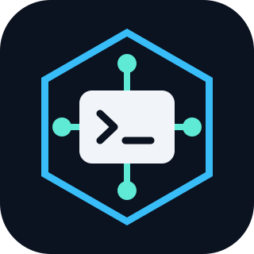

<div align="center">
  
  <h1>azvnet</h1>

  [](pyproject.toml)
  [](pyproject.toml)
  [](pyproject.toml)
  [](LICENSE)
</div>

---

You have your infrastructure repo and Azure credential, but your OpenTofu
backend only accepts connections from a private VNet. Delete the last VM
inside it and your terminal still has no route to state.

**azvnet runs OpenTofu where your state is reachable.**

Save this as `plan.py` (configuration and authentication follow):

```python
import json
from pathlib import Path

from azvnet import Bootstrap, Identity, VnetTofu

settings = json.loads(Path("azvnet.json").read_text())
settings["identity"] = Identity(**settings["identity"])
settings["bootstrap"] = Bootstrap(**settings["bootstrap"])

with VnetTofu(workdir=Path("infra"), **settings) as tofu:
    tofu.run("plan", "-input=false")
```

With no existing hosts configured, that creates a temporary Linux VM in your
VNet, runs OpenTofu using managed identity, checks the guest result, then
deletes the temporary resource group.

You still need the state backend, VNet, private DNS, outbound access and an
authorized user-assigned managed identity. The controller's service principal
must be allowed to create the temporary resources, attach that identity and
invoke Run Command. azvnet does not grant those permissions.

## Quick Start

### 1. Install

The controller needs Python 3.12+, uv, Git, Azure CLI, OpenSSL and `ssh-keygen`.
The Linux guest needs Bash, Python 3, OpenSSL, curl and tar.

Install the public source pin used by the consumers:

```sh
uv venv --python 3.12 &&
uv pip install --python .venv/bin/python \
  "azvnet @ git+https://github.com/npiesco/azvnet.git@8e88dcf9eb130cd473e15a71a93093d575534686"
```

There are no runtime Python dependencies. Installing the package needs no
GitHub PAT, deploy key or checkout of a consumer repository.

### 2. Supply the Azure credential

Inject `ARM_CLIENT_SECRET` through your runtime environment or secret manager.
Keep its value out of source, shell arguments and infrastructure configuration.

Set `AZVNET_CLI_PYTHON` to the Python interpreter containing your installed
`azure.cli` module. For Microsoft's Debian package:

```sh
export AZVNET_CLI_PYTHON=/opt/az/bin/python3
```

On a Windows controller the variable is required: `az` is installed as
`az.cmd`, so azvnet runs the command that file wraps, `<AZVNET_CLI_PYTHON>
-IBm azure.cli`, without `cmd.exe`. For Microsoft's MSI it is
`C:\Program Files\Microsoft SDKs\Azure\CLI2\python.exe`.

Tenant, subscription and client IDs come from the configuration below.
Conflicting `ARM_*` values are rejected.

An explicit `credential_file=Path(...)` is also supported. It must be owned
by the current user, nonsymlink and mode 0600, with these labelled fields:

```text
Tenant: <tenant UUID>
Client ID: <service-principal application UUID>
Secret: <runtime secret>
```

No credential filename is assumed. Do not commit that file.

On Windows, where mode bits do not describe access, the file must not be a
symlink or other reparse point, must be owned by the current user, and must
have a protected DACL granting access only to that user, for example
`icacls <file> /inheritance:r /grant:r "%USERNAME%:F"`.

### 3. Configure the VNet and run the plan

Put your OpenTofu root in `infra/`, including its `.tf` files and
`.terraform.lock.hcl`. Its backend must already describe your state storage.

Save the following as `azvnet.json`, replacing every placeholder. The identity
resource ID and client ID must identify the same user-assigned identity in the
configured subscription. Choose a VM size available in your VNet's region.

```json
{
  "tenant_id": "<tenant UUID>",
  "subscription_id": "<subscription UUID>",
  "client_id": "<service-principal application UUID>",
  "identity": {
    "resource_id": "/subscriptions/<subscription UUID>/resourceGroups/<identity group>/providers/Microsoft.ManagedIdentity/userAssignedIdentities/<identity name>",
    "client_id": "<managed-identity application UUID>"
  },
  "state_group": "<resource group containing the state VNet>",
  "state_vnet": "<VNet name>",
  "state_endpoint": "<storage account>.blob.core.windows.net",
  "bootstrap": {
    "location": "<VNet region>",
    "subnet": "<existing subnet name>",
    "image": "Ubuntu2404",
    "size": "<permitted Linux VM size>"
  },
  "tofu_version": "1.10.6"
}
```

Run the `plan.py` example from the directory containing those files:

```sh
.venv/bin/python plan.py
```

**The point:** the controller talks to Azure's control plane. OpenTofu talks
to private state from inside the VNet. The service-principal secret stays on
the controller; the guest uses managed identity.

## What you can use independently

| API | What it handles |
| --- | --- |
| `AzureSession` | Explicit Azure identity, checked CLI calls and local OpenTofu |
| `Remote` | Guest execution with checked completion; encrypted input/output when needed |
| `VnetTofu` | Configuration transfer, private-VNet OpenTofu and temporary-host cleanup |

For project creation/cloning, coding agents, isolated worktrees and self-hosted
GitHub Actions, use [`tnb-runner`](https://github.com/npiesco/tnb-runner).
Those are consumer responsibilities. azvnet does not know your repository,
runner labels, build commands or fleet layout.

## Keep local state local

You do not need private-VNet configuration to use the Azure wrapper. This
example expects a local backend in `infra/` and the named environment variables:

```python
import os
from pathlib import Path

from azvnet import AzureSession

with AzureSession(
    tenant_id=os.environ["ARM_TENANT_ID"],
    subscription_id=os.environ["ARM_SUBSCRIPTION_ID"],
    client_id=os.environ.get("ARM_CLIENT_ID"),
    interactive=True,
) as azure:
    azure.local_tofu(
        "init", "-reconfigure",
        "-backend-config=path=.local/personal/terraform.tfstate",
        workdir=Path("infra"),
    )
    azure.local_tofu("plan", "-input=false", workdir=Path("infra"))
```

Local execution also needs OpenTofu on the controller. With no SP credential,
`interactive=True` checks an existing cached user login for the selected
tenant/subscription. It does not start an interactive login or switch accounts.

SP login arguments travel over stdin. Each session owns a private Azure CLI
cache, disables CLI telemetry and removes its cache on close. Concurrent first
use is serialized; authenticated commands can run in parallel. Close the
session after its callers finish.

## Choose where OpenTofu runs

Pass `hosts=[Host(group="...", name="...")]` to allow existing hosts
(`Host` is exported by `azvnet`). This is an explicit list, not fleet discovery.
A host must be a provisioned Linux VM with private DNS and TLS connectivity
to the state endpoint. A stopped configured host is started; managed-identity
attachment is checked. `tofu init` checks backend access.

When no configured host can be used, azvnet creates an ownership-tagged group
for a temporary VM, NIC and disk. The VM has no public IP. Mutating OpenTofu
commands use a disposable host outside the managed fleet, so apply/destroy
cannot delete their own execution host.

| Bootstrap input | What you authorize |
| --- | --- |
| `subnet` | Use that subnet in the configured VNet |
| `subnet_cidr` | Create the subnet if missing, with that exact prefix |
| `nat_gateway_id` | Attach an existing, same-subscription/region NAT gateway when creating that subnet; requires `subnet_cidr` |
| `priority="Spot", max_price=-1` | Use Spot at the on-demand price ceiling; a nonnegative maximum price is also accepted |
| `record_bootstrap=callback` on `VnetTofu` | Record `(group_name, ownership_token)` before resource-group creation |

Regular capacity is the default. Spot uses Azure's `Delete` eviction policy.
azvnet does not substitute another region, SKU or pricing mode.

Existing subnet/NAT/NSG settings are left alone. A newly created subnet with
`nat_gateway_id` has implicit outbound access disabled; without that input,
Azure's default outbound settings apply. Supply egress appropriate to your
network policy.

Cleanup covers failures during creation, identity attachment and execution.
Deletion checks the exact invocation's ownership tag and confirms group
absence. A control-plane outage can still prevent cleanup; the reported group
and ownership token are the recovery boundary, not a name prefix.

## Send configuration and variables

The default bundle contains top-level `*.tf` files and `.terraform.lock.hcl`.
Use `config_files=[...]` for templates or local modules. Symlinks and paths
outside the work directory are rejected.

| Input | How it reaches OpenTofu |
| --- | --- |
| `variables={"enabled": True}` | Typed JSON in a guest-side automatic variable file |
| `tf_var_env=tf_var_environment(os.environ)` | Raw `TF_VAR_*` strings, interpreted using declared OpenTofu types |
| `-var-file=PATH` | Copied into the guest; explicit files override automatic files/environment in command-line order |
| Inline `-var` | Rejected; use the typed-variable input |
| `migrate_state(Path(...))` | Encrypted transfer followed by non-forced `tofu state push`; lineage/serial conflicts remain errors |

`tf_var_environment` is exported by `azvnet`; its argument is the caller's
environment mapping. Every supplied variable must exist in your configuration.

An explicit `run("init", ...)` keeps its init arguments. Other verbs receive
an automatic `init -input=false -no-color` first. Remote plan files are
ephemeral: `-out`, workstation state paths and unsupported remote file/control
arguments fail rather than imply an artifact you can retrieve later.

## Know whether the guest succeeded

Azure CLI exit zero is not enough. Calls require CLI success, ARM success and
one fresh, exact completion line in stdout. Stale, duplicate, missing or
truncated proofs fail. Linux's wrapped response and Windows' separate stream
statuses are checked.

`Remote.run()` is for non-sensitive scripts. `Remote.sealed()` encrypts input
and output with invocation-specific keys. Linux uses a private `/run`
directory; Windows uses a restricted directory and machine certificate.
Retained Azure agent scripts contain ciphertext/setup/cleanup, not decrypted
input or output. Your script must still avoid passing secrets in child argv.

> **Capture is still required.** Use `capture=True` for sensitive output.
> `RemoteExecutionError` exposes `returncode`, `stdout` and `stderr` without
> putting decrypted output in its message. Handle those attributes privately.

State pulls, named outputs, raw/JSON show/output, `-show-sensitive` and
`-json-into` require capture. Plain redacted listings remain usable without it.
Failed captured local stdout stays in the exception; stderr remains diagnostic.
Successful capture strips Azure wrappers and the completion proof.

Sealed output is limited to 8 MiB before JSON encoding. Encrypted chunks have
checked lengths; missing/truncated data is an error. Per-VM locks serialize
transactions within one process. Other controllers can still occupy Azure's
single Run Command slot and cause a Conflict; there is no timed retry.
Readiness uses native completion, with an outer job watchdog if a bound is needed.

## Recover an interrupted cleanup

Pass `record_cleanup` to `Remote` or `VnetTofu` to retain nonsecret recovery
metadata. For example, this callback writes a private, durable receipt:

```python
from pathlib import Path

from azvnet import CleanupResidue

def record_cleanup(residue: CleanupResidue) -> Path:
    return residue.write(Path(".local/run-command-residue"))
```

Receipts contain the exact subscription/group/VM, invocation directory/token,
OS and Windows certificate subject where applicable. They contain no payload,
output, key bytes or credential. Files are owned mode 0600 in a mode-0700
directory. On Windows the directory is created with a protected DACL granting
only the current user, its records inherit it, and an existing directory must
be that user's, with that DACL, and not a reparse point. Without a callback,
diagnostics go to stderr without durable storage.

A receipt means cleanup is **unconfirmed**, not that a key definitely remains.
Establish that the original and any competing Run Command have finished before
touching the recorded path. Remove only that inactive invocation directory.
For Windows, also match the recorded certificate subject, remove that exact
certificate with `-DeleteKey`, and confirm the recorded CNG key path is absent.
Retain the receipt and recovery result. Do not delete by directory/name prefix.

Cleanup and receipt-write failures stay visible without replacing the original
execution failure. azvnet does not automatically recover abandoned invocations.

## Testing

From an azvnet checkout:

```sh
uv sync --locked &&
uv run --locked ruff check src tests &&
uv run --locked mypy src &&
AZVNET_CLI_PYTHON=/opt/az/bin/python3 \
  uv run --locked python -m unittest discover -s tests -v
```

The suite uses installed Azure CLI, provider-free OpenTofu configurations,
Bash and OpenSSL. The Linux TLS fixture needs passwordless `sudo` for its
dedicated loopback address/port and uses generated test certificates.

Cloud acceptance needs an explicitly assigned subscription/VM, SP authority,
private endpoint access and managed-identity permissions. For an assigned
Windows guest, supply the `ARM_*` identity/secret inputs and set `GROUP`/`VM`
before running:

```sh
uv run --locked python tests/live_windows.py --group "$GROUP" --vm "$VM" --phase plain &&
uv run --locked python tests/live_windows.py --group "$GROUP" --vm "$VM" --phase sealed
```

With `--interactive`, the session instead reuses the cached Azure CLI user of an
explicitly set `AZURE_CONFIG_DIR` (with `ARM_TENANT_ID` and
`ARM_SUBSCRIPTION_ID`), and verifies that context is still present afterwards
rather than removed. No client ID or secret is read.

Those checks exercise failures, framing, encrypted output and exact key/directory
cleanup. They do not install software, register runners or alter networking.
